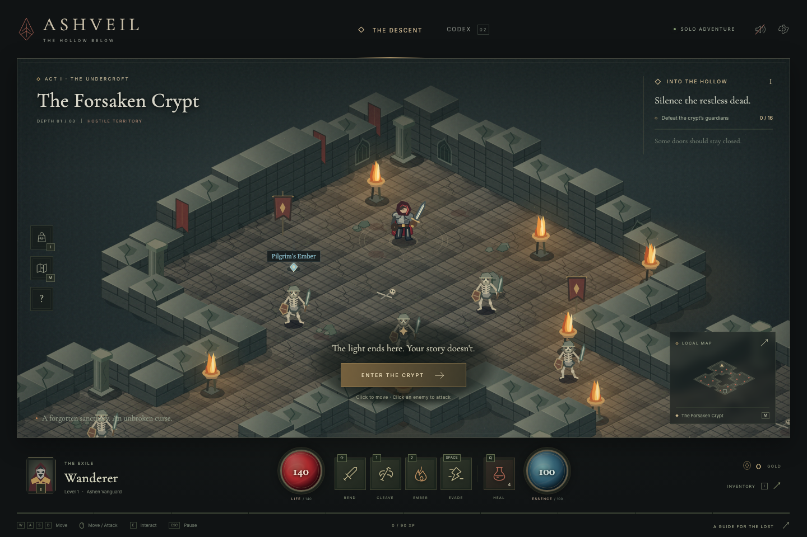

# Ashveil

An original, playable isometric dungeon crawler inspired by classic Diablo-style action RPGs. Descend through three floors, defeat the dungeon's guardians, collect equipment, and escape the depths. All characters, architecture, lighting, and effects are drawn with original Canvas 2D artwork; no game assets or external services are required.



## Play locally

Use Node.js 22 or newer. There are no dependencies to install.

```sh
npm start
```

Open [http://127.0.0.1:4173](http://127.0.0.1:4173). Choose another port with `npm start -- --port 4174` or `PORT=4174 npm start`. The development server binds to your computer's loopback address. Stop it with Ctrl+C.

The dungeon starts paused so you can get your bearings. Click the dungeon, press the entrance button, or begin moving to start the run.

## The descent

Each floor has a different enemy encounter. Clear every hostile to unlock the exit, then interact with it to descend. On the final floor, defeat the boss and its remaining forces before using the exit to win. Equip recovered weapons, armor, and relics to improve your chances; spend mana on skills and keep healing potions ready. Death ends the current run.

| Control                          | Action                                              |
| -------------------------------- | --------------------------------------------------- |
| WASD / arrow keys                | Move in the direction shown on screen               |
| Left-click terrain               | Move to that point                                  |
| Left-click an enemy              | Chase and attack that enemy                         |
| Hold right mouse button or Shift | Basic attack                                        |
| 1                                | Cleave: nearby area attack                          |
| 2                                | Fireball: ranged attack toward the pointer          |
| Space                            | Dodge toward the pointer or your movement direction |
| Q                                | Drink a healing potion                              |
| E                                | Use a nearby unlocked exit                          |
| I                                | Open inventory                                      |
| M                                | Open the map                                        |
| Escape                           | Pause / resume                                      |

Help and settings pause the game. On a touch screen, tap terrain to move, tap an enemy to attack, and use the on-screen action buttons for skills, healing, and exits.

Your best record and sound preference are saved in this browser's local storage. A run cannot be saved and resumed after reloading the page. There is no account, online multiplayer, or cloud save.

## Verify and build

```sh
npm run check
npm test
npm run build
```

The syntax checker covers the game and build scripts; the automated tests exercise the simulation. GitHub Actions runs these checks on pushes and pull requests using Node.js 22. The build produces a fresh `dist/` directory containing the static game. Publish that directory to a static host; no application server is needed. Serve the files over HTTP rather than opening `index.html` directly, since the game uses ES modules.

## Project structure

- `index.html`: application shell and interface.
- `src/main.js`: input, interface, browser storage, and the game loop.
- `src/engine.js`: dungeon simulation, combat, loot, and progression.
- `src/renderer.js`: isometric Canvas 2D artwork and minimap.
- `src/style.css`: responsive game interface.
- `tests/`: simulation tests using Node's built-in test runner.
- `scripts/`: dependency-free local server, syntax checker, and static build.
- [Architecture](docs/architecture.md): module boundaries, game state, rendering, and verification.

Ashveil is an independent prototype. Diablo is a trademark of Blizzard Entertainment; this project is not affiliated with or endorsed by Blizzard.
